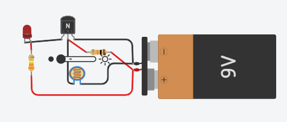
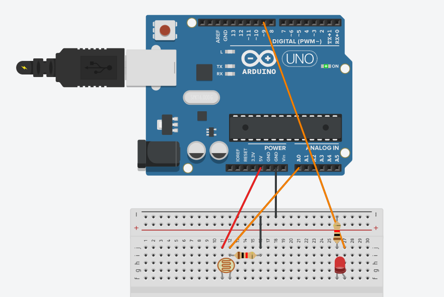
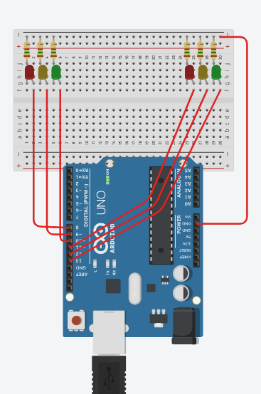
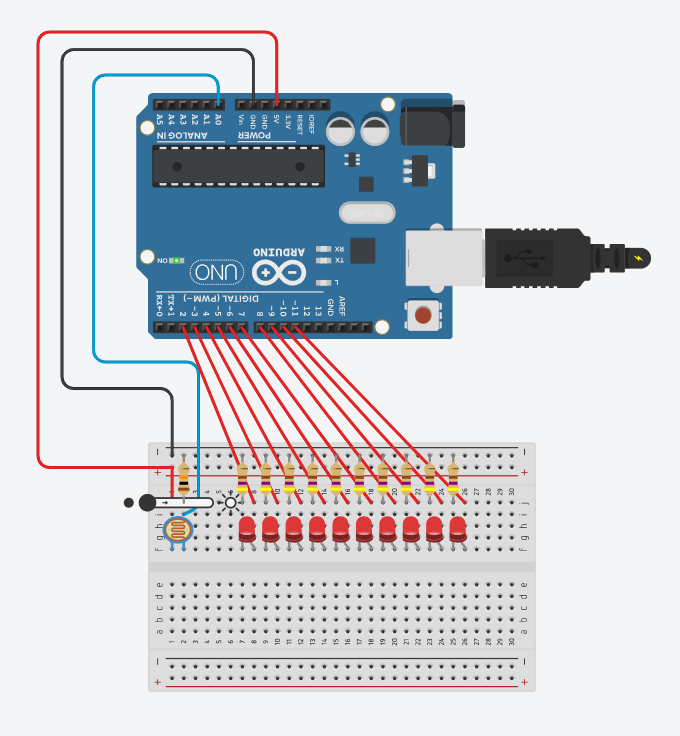
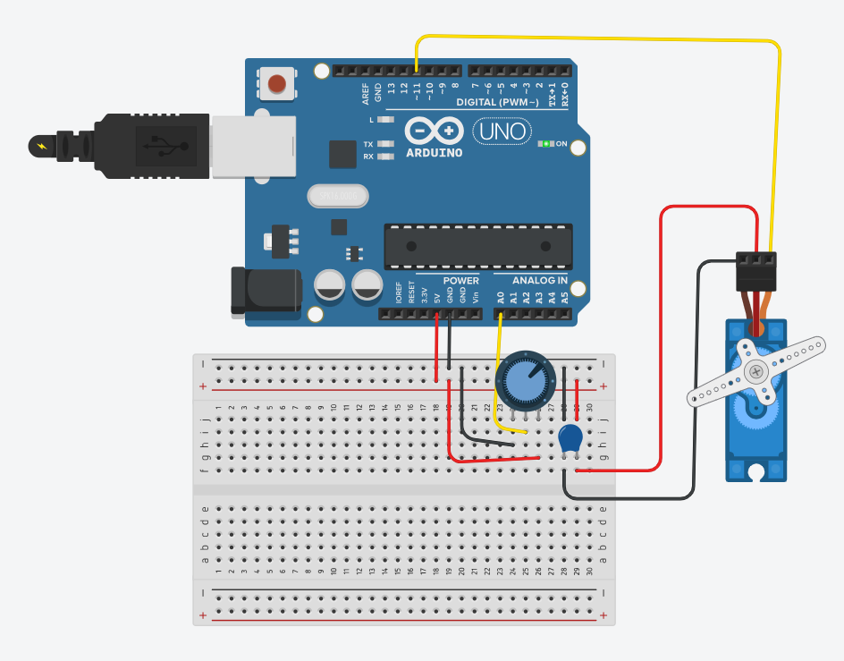
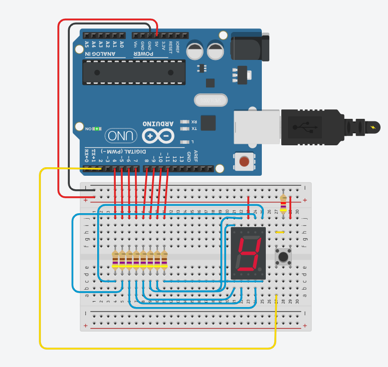
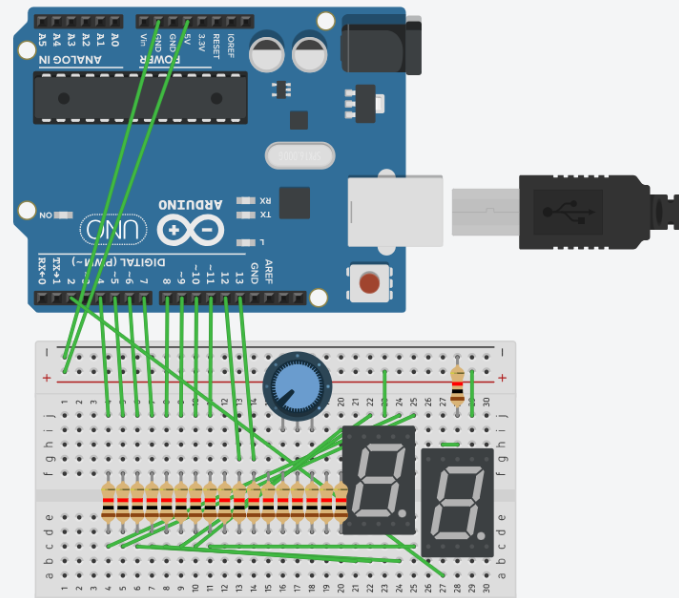
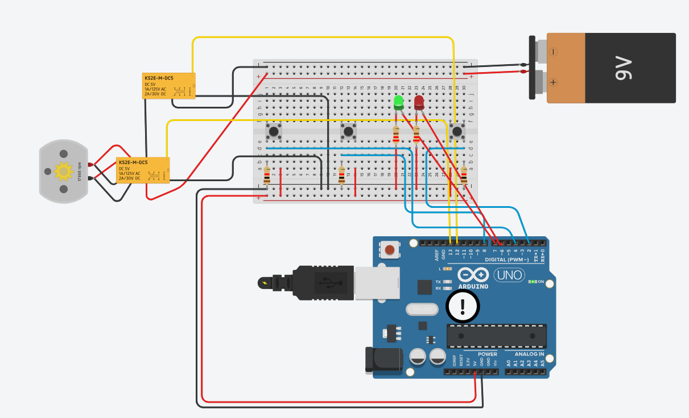

# Atividades de IoT - Arduino e Dashboard Web

## Sobre o projeto

Este repositório reúne as atividades práticas desenvolvidas durante as aulas de IoT, utilizando Arduino, componentes eletrônicos e o Tinkercad para realizar as simulações.

Também foi desenvolvido um Dashboard Web utilizando HTML, CSS e JavaScript para apresentar os dados relacionados ao funcionamento de um portão eletrônico.

---

# Aula 02 - Componentes eletrônicos básicos

## Poste com LED e fotoresistor

Nesta atividade foi montado um circuito que simula o funcionamento de um poste de iluminação automática.

O circuito utiliza um LED, um fotoresistor (LDR), resistores, uma bateria de 9V e um transistor NPN.

O funcionamento ocorre de acordo com a luminosidade do ambiente:

- Durante o dia, o LDR recebe mais luz e o LED permanece apagado ou com pouca intensidade.
- Durante a noite, a resistência do LDR aumenta e o LED acende.

### Poste sem Arduino

Nesta versão, o circuito funciona somente com componentes eletrônicos, sem utilizar um Arduino.



### Poste com Arduino

Também foi realizado o funcionamento do poste utilizando Arduino, permitindo que o sensor de luminosidade seja utilizado para controlar o LED por programação.



---

# Aula 03 - Desafios com Arduino

## Semáforo de duas vias e pedestres

Nesta atividade foi desenvolvido um protótipo de um cruzamento utilizando dois semáforos controlados por um Arduino UNO.

Foram utilizados LEDs verdes, amarelos e vermelhos para representar os semáforos dos veículos. Também foram adicionados LEDs para representar a travessia de pedestres.

A programação foi feita para manter os dois semáforos sincronizados, evitando que os dois lados fiquem verdes ao mesmo tempo.

Os tempos definidos foram:

- Verde: 2,5 segundos
- Amarelo: 0,5 segundo
- Vermelho: 3 segundos

O semáforo de pedestres também foi configurado para permitir a travessia somente quando os veículos estão parados.



---

## Pista de pouso

Nesta atividade foi criado um sistema de iluminação para simular as luzes de uma pista de pouso.

O circuito utiliza um fotoresistor para identificar a luminosidade do ambiente e vários LEDs para representar as luzes da pista.

Quando a luminosidade diminui, as luzes são acionadas. Conforme a luminosidade aumenta, os LEDs começam a ser apagados.



---

# Aula 04 - Desafios com Arduino

## Servo motor controlado por potenciômetro

Nesta atividade foi utilizado um potenciômetro para controlar a posição de um micro servo motor.

Ao girar o potenciômetro, o Arduino realiza a leitura do valor recebido e utiliza essa informação para determinar o ângulo do servo motor.

Também foi utilizado um capacitor para auxiliar no funcionamento do circuito.



---

## Display de 7 segmentos

Nesta atividade foi utilizado um Arduino UNO conectado a um display de 7 segmentos.

O objetivo foi criar um contador de 0 a 9. A cada acionamento do botão, o número apresentado no display é alterado.

O Arduino controla individualmente os segmentos do display para formar cada número.



---

## Desafio do display duplo

Como continuação da atividade anterior, foi desenvolvido o desafio de utilizar dois displays de 7 segmentos para representar números de 00 a 99.

Dessa forma, o circuito consegue apresentar números com duas casas utilizando os dois displays.



---

# Situação desafiadora - Portão eletrônico

Nesta atividade foi desenvolvido um protótipo de um portão eletrônico utilizando Arduino UNO.

O circuito utiliza um motor CC e relês para controlar o movimento do portão. Também foram utilizados botões para realizar os comandos de abertura e fechamento.

Além disso, foram adicionados LEDs vermelho e verde para representar a sinalização da saída da garagem.

O objetivo da atividade foi desenvolver um sistema de automação capaz de controlar o portão por meio do Arduino.



---

# Dashboard Web

Após o desenvolvimento do protótipo do portão eletrônico, foi proposta a criação de uma interface Web para visualizar os dados relacionados às aberturas do portão.

O Dashboard foi desenvolvido utilizando:

- HTML
- CSS
- JavaScript
- Dados fornecidos no arquivo `dados.csv`

A página apresenta os dados por meio de gráficos, permitindo visualizar a atividade do portão em diferentes períodos.

O Dashboard possui principalmente:

- Gráfico de atividade diária;
- Gráfico de atividade semanal.

O projeto foi preparado para ser publicado utilizando o GitHub Pages.

---

## Sobre o site

O Dashboard Web funciona como uma interface para facilitar a visualização dos dados do portão eletrônico.

Em vez de analisar os dados diretamente em uma tabela, o usuário consegue observar as informações por meio de gráficos, tornando mais fácil identificar os dias e períodos em que o portão teve maior ou menor quantidade de acionamentos.

O site representa uma possível aplicação de IoT, na qual um dispositivo como um Arduino ou ESP32 poderia enviar os dados de funcionamento para serem armazenados e posteriormente apresentados em uma interface Web.

---

# Tecnologias utilizadas

- Arduino UNO
- Tinkercad
- HTML
- CSS
- JavaScript
- GitHub Pages

---

# Organização dos arquivos

```text
.
├── index.html
├── style.css
├── script.js
├── dados.csv
└── prints/
    ├── poste-sem-arduino.png
    ├── poste-com-arduino.png
    ├── semaforo.png
    ├── pista-pouso.png
    ├── servo.png
    ├── display-7-segmentos.png
    ├── display-duplo.png
    └── portao.png
